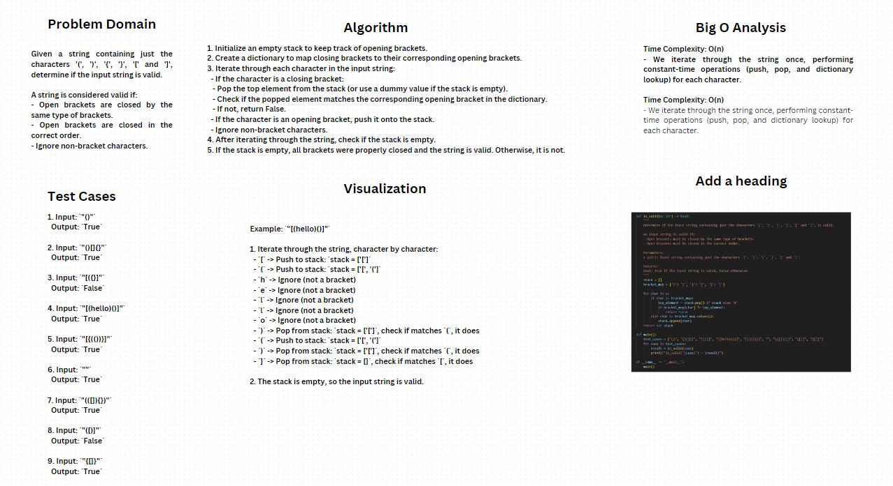

# Whiteboard



## Problem Domain
Given a string containing just the characters '(', ')', '{', '}', '[' and ']', determine if the input string is valid.

A string is considered valid if:
- Open brackets are closed by the same type of brackets.
- Open brackets are closed in the correct order.
- Ignore non-bracket characters.

## Algorithm
1. Initialize an empty stack to keep track of opening brackets.
2. Create a dictionary to map closing brackets to their corresponding opening brackets.
3. Iterate through each character in the input string:
   - If the character is a closing bracket:
     - Pop the top element from the stack (or use a dummy value if the stack is empty).
     - Check if the popped element matches the corresponding opening bracket in the dictionary.
     - If not, return False.
   - If the character is an opening bracket, push it onto the stack.
   - Ignore non-bracket characters.
4. After iterating through the string, check if the stack is empty.
5. If the stack is empty, all brackets were properly closed and the string is valid. Otherwise, it is not.


## Test Cases
1. Input: `"()"`  
   Output: `True`

2. Input: `"()[]{}"`  
   Output: `True`

3. Input: `"[({}]"`  
   Output: `False`

4. Input: `"[(hello)()]"`  
   Output: `True`

5. Input: `"[{(())}]"`  
   Output: `True`

6. Input: `""`  
   Output: `True`

7. Input: `"(([]){})"`  
   Output: `True`

8. Input: `"([)]"`  
   Output: `False`

9. Input: `"{[]}"`  
   Output: `True`

## Big O Analysis
### Time Complexity: O(n)
- We iterate through the string once, performing constant-time operations (push, pop, and dictionary lookup) for each character.

### Time Complexity: O(n)
- We iterate through the string once, performing constant-time operations (push, pop, and dictionary lookup) for each character.


## Visualization

### Example: `"[(hello)()]"`

1. Iterate through the string, character by character:
   - `[` -> Push to stack: `stack = ['[']`
   - `(` -> Push to stack: `stack = ['[', '(']`
   - `h` -> Ignore (not a bracket)
   - `e` -> Ignore (not a bracket)
   - `l` -> Ignore (not a bracket)
   - `l` -> Ignore (not a bracket)
   - `o` -> Ignore (not a bracket)
   - `)` -> Pop from stack: `stack = ['[']`, check if matches `(`, it does
   - `(` -> Push to stack: `stack = ['[', '(']`
   - `)` -> Pop from stack: `stack = ['[']`, check if matches `(`, it does
   - `]` -> Pop from stack: `stack = []`, check if matches `[`, it does

2. The stack is empty, so the input string is valid.


## Pseudocode
```python
def is_valid(s: str) -> bool:
    stack = []
    bracket_map = {')': '(', '}': '{', ']': '['}

    for char in s:
        if char in bracket_map:
            top_element = stack.pop() if stack else '#'
            if bracket_map[char] != top_element:
                return False
        elif char in bracket_map.values():
            stack.append(char)
    return not stack
