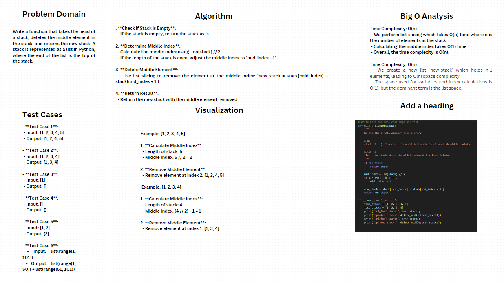

# Whiteboard Explanation for Challenge 03: Delete Middle Node


## Problem Domain
Write a function that takes the head of a stack, deletes the middle element in the stack, and returns the new stack. A stack is represented as a list in Python, where the end of the list is the top of the stack.

## Algorithm
1. **Check if Stack is Empty**:
   - If the stack is empty, return the stack as is.
   
2. **Determine Middle Index**:
   - Calculate the middle index using `len(stack) // 2`.
   - If the length of the stack is even, adjust the middle index to `mid_index - 1`.

3. **Delete Middle Element**:
   - Use list slicing to remove the element at the middle index: `new_stack = stack[:mid_index] + stack[mid_index + 1:]`.

4. **Return Result**:
   - Return the new stack with the middle element removed.

## Test Cases
- **Test Case 1**:
  - Input: [1, 2, 3, 4, 5]
  - Output: [1, 2, 4, 5]

- **Test Case 2**:
  - Input: [1, 2, 3, 4]
  - Output: [1, 3, 4]

- **Test Case 3**:
  - Input: [1]
  - Output: []

- **Test Case 4**:
  - Input: []
  - Output: []

- **Test Case 5**:
  - Input: [1, 2]
  - Output: [2]

- **Test Case 6**:
  - Input: list(range(1, 101))
  - Output: list(range(1, 50)) + list(range(51, 101))

## Big O Analysis
- **Time Complexity**: O(n)
  - We perform list slicing which takes O(n) time where n is the number of elements in the stack.
  - Calculating the middle index takes O(1) time.
  - Overall, the time complexity is O(n).
  
- **Space Complexity**: O(n)
  - We create a new list `new_stack` which holds n-1 elements, leading to O(n) space complexity.
  - The space used for variables and index calculations is O(1), but the dominant term is the list space.

## Visualization
### Example: [1, 2, 3, 4, 5]

1. **Calculate Middle Index**:
   - Length of stack: 5
   - Middle index: 5 // 2 = 2

2. **Remove Middle Element**:
   - Remove element at index 2: [1, 2, 4, 5]

### Example: [1, 2, 3, 4]

1. **Calculate Middle Index**:
   - Length of stack: 4
   - Middle index: (4 // 2) - 1 = 1

2. **Remove Middle Element**:
   - Remove element at index 1: [1, 3, 4]

## Pseudocode

```python
def delete_middle(stack):
    if not stack:
        return stack
    
    mid_index = len(stack) // 2
    if len(stack) % 2 == 0:
        mid_index -= 1
    
    new_stack = stack[:mid_index] + stack[mid_index + 1:]
    return new_stack

if __name__ == "__main__":
    test_stack1 = [1, 2, 3, 4, 5]
    test_stack2 = [1, 2, 3, 4]
    print("Original stack:", test_stack1)
    print("Updated stack:", delete_middle(test_stack1))
    print("Original stack:", test_stack2)
    print("Updated stack:", delete_middle(test_stack2))
