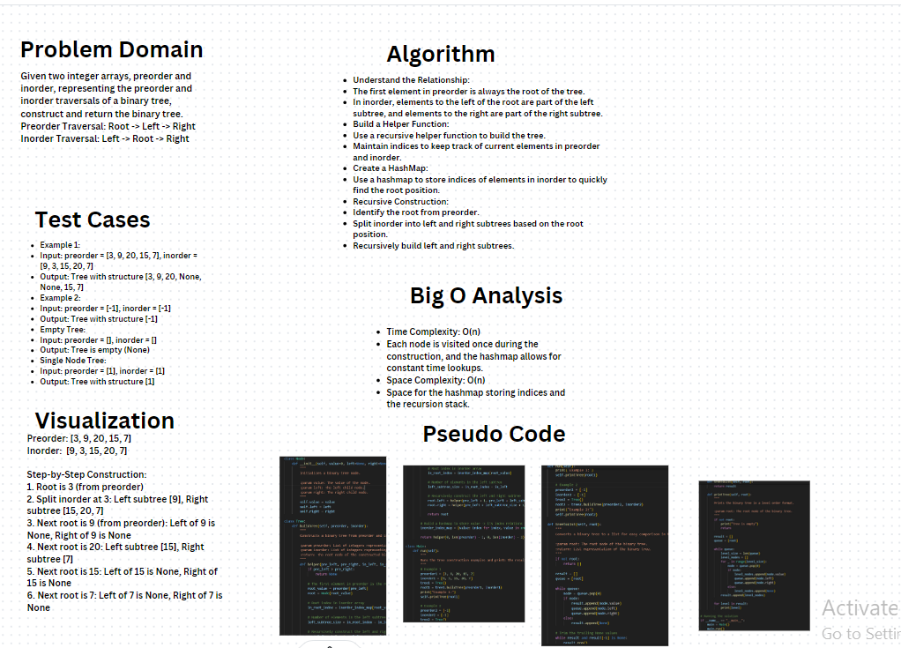

# Whiteboard

# Challenge01 - Construct BT from Preorder & Inorder

## Problem Description
Construct Binary Tree from Preorder and Inorder Traversal:
Given two integer arrays, `preorder` and `inorder`, where `preorder` is the preorder traversal of a binary tree and `inorder` is the inorder traversal of the same tree, construct and return the binary tree.

## Example 1
- Input: `preorder = [3,9,20,15,7]`, `inorder = [9,3,15,20,7]`
- Output: `[3,9,20,null,null,15,7]`

## Example 2
- Input: `preorder = [-1]`, `inorder = [-1]`
- Output: `[-1]`
## Solution
1. Use a helper function to construct the tree recursively by using the indices of the preorder and inorder arrays.
2. Create a hashmap to store the index of each value in the inorder array to optimize the search time.
3. Recursively divide the arrays to construct the left and right subtrees.

