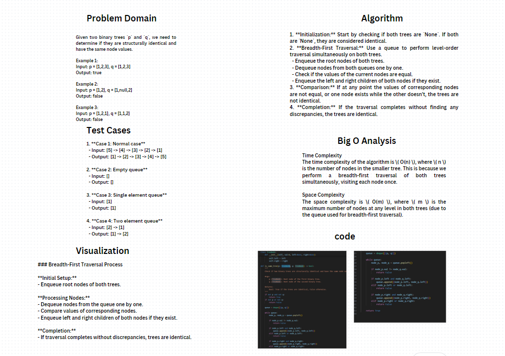

# whiteboard


## Problem Domain

Given two binary trees `p` and `q`, we need to determine if they are structurally identical and have the same node values.

### Examples

Example 1:
Input: p = [1,2,3], q = [1,2,3]
Output: true

Example 2:
Input: p = [1,2], q = [1,null,2]
Output: false

Example 3:
Input: p = [1,2,1], q = [1,1,2]
Output: false

## Algorithm

### Approach

1. **Initialization:** Start by checking if both trees are `None`. If both are `None`, they are considered identical.
2. **Breadth-First Traversal:** Use a queue to perform level-order traversal simultaneously on both trees.
   - Enqueue the root nodes of both trees.
   - Dequeue nodes from both queues one by one.
   - Check if the values of the current nodes are equal.
   - Enqueue the left and right children of both nodes if they exist.
3. **Comparison:** If at any point the values of corresponding nodes are not equal, or one node exists while the other doesn't, the trees are not identical.
4. **Completion:** If the traversal completes without finding any discrepancies, the trees are identical.


## Big O Analysis

### Time Complexity
The time complexity of the algorithm is \( O(n) \), where \( n \) is the number of nodes in the smaller tree. This is because we perform a breadth-first traversal of both trees simultaneously, visiting each node once.

### Space Complexity
The space complexity is \( O(m) \), where \( m \) is the maximum number of nodes at any level in both trees (due to the queue used for breadth-first traversal).

## Visualization

### Breadth-First Traversal Process

**Initial Setup:**
- Enqueue root nodes of both trees.

**Processing Nodes:**
- Dequeue nodes from the queue one by one.
- Compare values of corresponding nodes.
- Enqueue left and right children of both nodes if they exist.

**Completion:**
- If traversal completes without discrepancies, trees are identical.


## Test Cases

### Example 1: Identical Trees
```python
Input:
p = [1, 2, 3]
q = [1, 2, 3]
Output:
True
Input:
p = [1, 2]
q = [1, null, 2]
Output:
False
Input:
p = [1, 2, 1]
q = [1, 1, 2]
Output:
False
Input:
p = [1, 2, 3]
q = None
Output:
False


### Pseudocode

```plaintext
function is_same_tree(p, q):
    if p is None and q is None:
        return true
    if p is None or q is None:
        return false
    
    queue = [(p, q)]
    
    while queue is not empty:
        node_p, node_q = dequeue(queue)
        
        if node_p.val != node_q.val:
            return false
        
        if node_p.left is not None and node_q.left is not None:
            enqueue(queue, (node_p.left, node_q.left))
        elif node_p.left is not None or node_q.left is not None:
            return false
        
        if node_p.right is not None and node_q.right is not None:
            enqueue(queue, (node_p.right, node_q.right))
        elif node_p.right is not None or node_q.right is not None:
            return false
    
    return true
